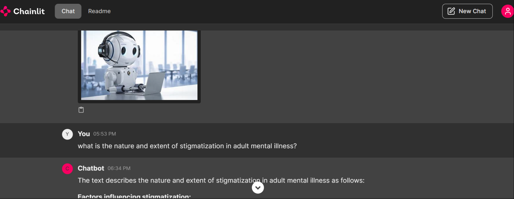

# RAGGEMMA PDF Question Answering System

This project is a PDF question-answering system that uses Ollama, LangChain, and Chainlit to process PDF documents and answer questions based on their content.

## Prerequisites

- Python 3.8 or higher
- Ollama installed on your system

## Installation

1. Clone the repository:
git clone https://github.com/your-username/RAGGEMMA.git
cd RAGGEMMA
Copy
2. Create a virtual environment:
python -m venv env
Copy
3. Activate the virtual environment:
env\Scripts\activate
Copy
4. Create a .env file in the project root directory:
touch .env
Copy
5. Add any necessary environment variables to the .env file. For example:
OLLAMA_HOST=http://localhost:11434
Copy
6. Install the required packages:
pip install -r requirements.txt
Copy
## Setting up Ollama

1. Install Ollama from [https://ollama.ai/](https://ollama.ai/)

2. Start the Ollama server:
ollama serve
Copy
3. Pull the required models:
C:\Users\shash\AppData\Local\Programs\Ollama\ollama.exe pull gemma:7b
C:\Users\shash\AppData\Local\Programs\Ollama\ollama.exe pull phi3
C:\Users\shash\AppData\Local\Programs\Ollama\ollama.exe pull nomic-embed-text
Copy
## Running the Application

1. Ensure Ollama is running:
ollama serve
Copy
2. Start the Chainlit application:
chainlit run app.py
Copy
3. Open your web browser and go to `http://localhost:8000` to access the chat interface.

4. Upload a PDF file when prompted and start asking questions about its content.

## Managing Ollama

### Checking if Ollama is Running
To check if Ollama is using its default port (11434):
netstat -ano | findstr :11434
Copy
### Stopping Ollama
If you need to stop Ollama:

1. Find the process using port 11434:
netstat -ano | findstr :11434
Copy
2. Note the Process ID (PID) from the output.

3. Stop the process using the Task Manager or the following command:
taskkill /PID <PID> /F
CopyReplace `<PID>` with the actual Process ID you found.

## Additional Commands

- To upload a new PDF file during a chat session, type "upload new pdf" in the chat interface.

## Troubleshooting

If you encounter any issues, make sure:
- Ollama is running (`ollama serve`)
- Required models are downloaded
- All dependencies are installed correctly
- Your .env file is properly configured
- You're in the activated virtual environment

For any persistent problems, please open an issue in the GitHub repository
